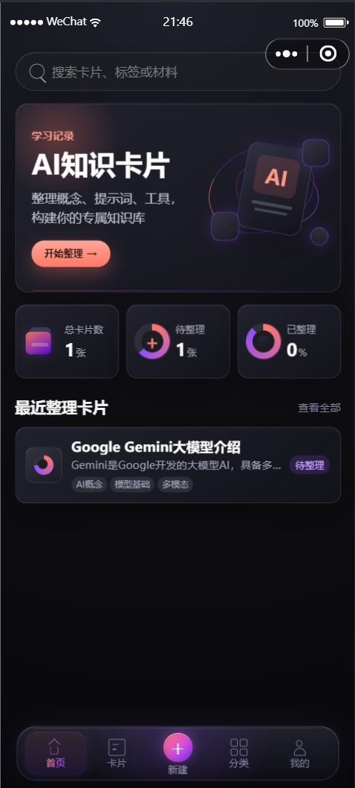
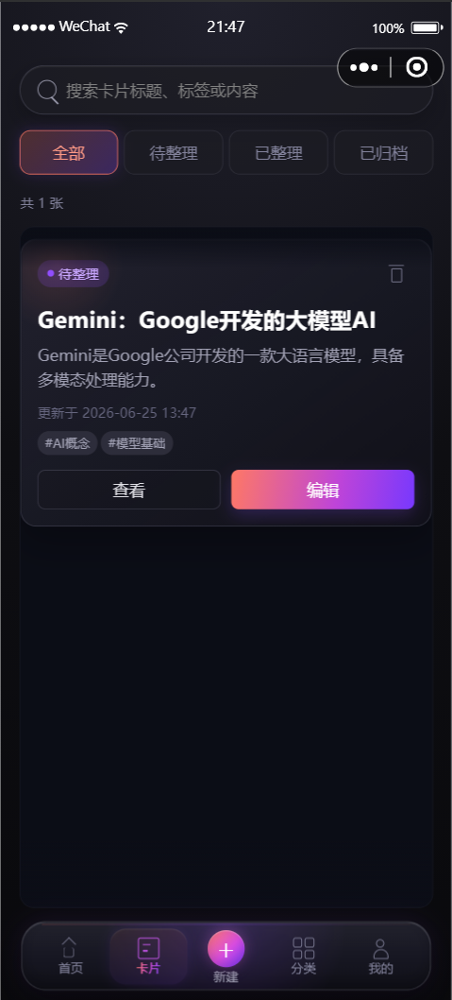
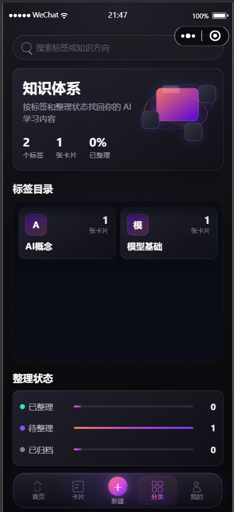
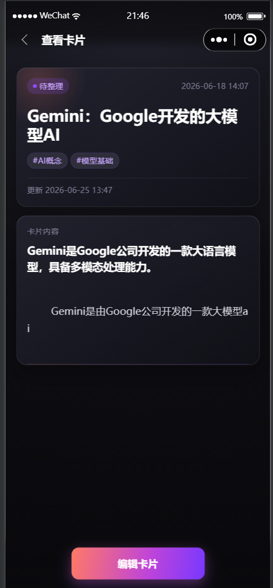
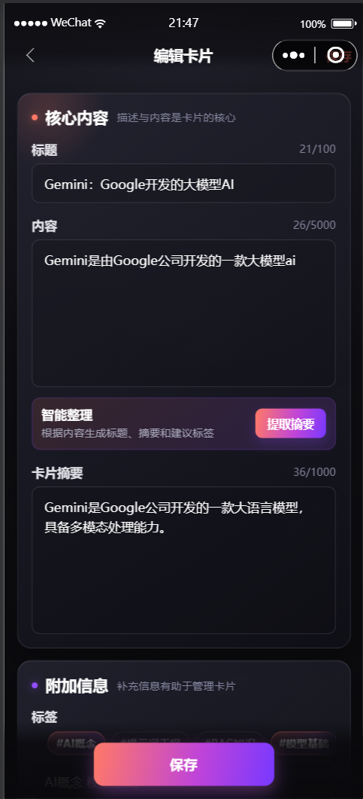
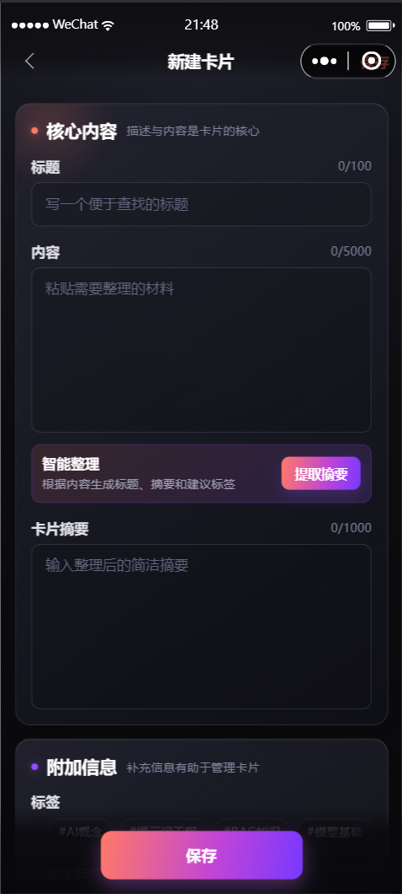
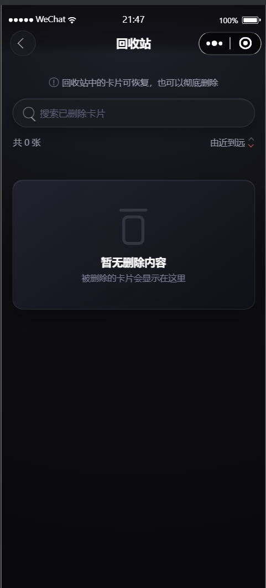
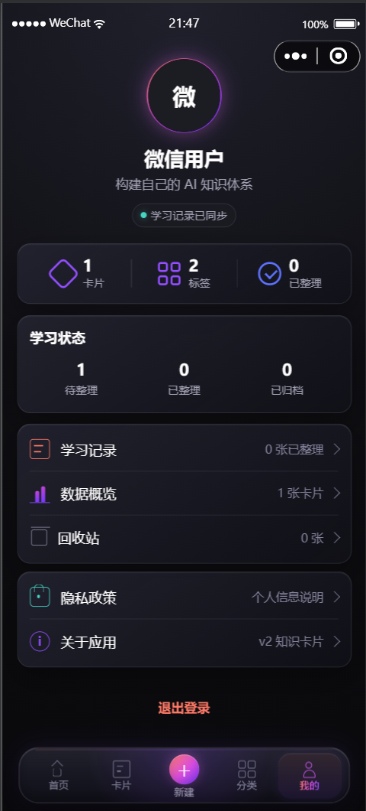

# WantTodo — 微信小程序「AI 知识卡片」

<p align="center">
  <strong>📇 个人学习材料整理工具 · 暗色卡片体验 · AI 智能整理</strong>
</p>

<p align="center">
  
  
  
  
</p>

---

## 📸 截图预览

以下截图展示核心使用流程：工作台、内容池、分类、卡片详情、智能整理、新建卡片、回收站和个人中心。

<p align="center">
  
  
  
</p>
<p align="center">
  
  
  
</p>
<p align="center">
  
  
</p>

---

## 🚀 这是什么？

WantTodo 是一个微信小程序，帮你**收集 → 整理 → 回顾**学习材料。

- **粘贴**一段文章、笔记、摘录
- **AI 智能整理**生成标题、摘要、建议标签（可选，自己手动填也行）
- **暗色卡片 UI**，好看不刺眼
- **标签体系** + **全文搜索**快速找回内容
- **软删除 + 回收站**，误删不慌

> 定位是**个人工具**，不做公共广场、不做推荐流、不做评论互动。不联网也能用（AI 整理需要配置第三方 API）。

---

## 🧱 技术栈

| 层 | 技术 |
|----|------|
| 前端 | 微信小程序原生框架（WXML + WXSS + JS） |
| 后端 | ASP.NET Core 10（C#） |
| 数据库 | SQLite（轻量，零配置部署） |
| 鉴权 | 微信登录 code2Session + JWT |
| AI 整理 | 可对接 DeepSeek / OpenAI 兼容 API |
| 部署 | 2GB 服务器即够，跑在 Linux/Windows 均可 |

---

## 📁 项目结构

```
wanttodo/
├── miniprogram/              # 微信小程序前端
│   ├── pages/
│   │   ├── index/            # 工作台首页
│   │   ├── content-pool/     # 内容池（全部卡片）
│   │   ├── pending/          # 待整理列表
│   │   ├── card-form/        # 新建/编辑卡片
│   │   ├── card-detail/      # 卡片详情
│   │   ├── recycle-bin/      # 回收站
│   │   ├── privacy-policy/   # 隐私政策
│   │   └── profile/          # 我的页面
│   ├── components/           # 公共组件
│   ├── services/             # API 调用封装
│   ├── utils/                # 工具函数
│   ├── config.js             # API 地址配置
│   └── app.js / app.json     # 小程序入口
├── WantTodo.Api/             # ASP.NET 后端
│   ├── Controllers/          # API 控制器
│   ├── Models/               # 数据模型
│   ├── Data/                 # 数据库上下文
│   ├── DTOs/                 # 请求/响应对象
│   └── Program.cs            # 启动入口
├── docs/                     # 文档
│   ├── API-CONTRACT.md       # API 接口约定
│   └── PRODUCT-CONTRACT.md   # 产品业务约定
├── .gitignore
├── LICENSE
└── README.md
```

---

## 🛠 30 分钟跑起来

### 1. 克隆仓库

```bash
git clone git@github.com:xuanlangzhu-hub/wanttodo-miniapp.git
cd wanttodo-miniapp
```

### 2. 启动后端

```bash
cd WantTodo.Api

# 还原依赖
dotnet restore

# 启动（默认 localhost:5000）
dotnet run
```

首次启动会自动创建 `WantTodo.db`（SQLite 数据库文件）。

### 3. 配置小程序

在**微信开发者工具**中打开 `wanttodo/` 目录（project.config.json 指向 miniprogram/）。

修改 `miniprogram/config.js`，选择环境：

```js
const activeEnv = "simulator";  // 本地开发用 simulator
// "device" — 同一局域网真机调试
// "production" — 已部署的域名
```

### 4. 开发模式登录

后端启动后，在开发者工具中访问：

```
GET http://localhost:5000/api/v1/auth/dev-token
```

返回的 token 会自动用于开发测试（`DevMode: true` 时可用）。

---

## 🔧 改成你自己的

### 必须改的

| 文件 | 字段 | 改成什么 |
|------|------|---------|
| `project.config.json` | `appid` | 你的微信小程序 AppID |
| `WantTodo.Api/appsettings.json` | `Jwt:Key` | **生产环境必须换一个随机长字符串** |
| `WantTodo.Api/appsettings.json` | `Wechat:AppId` | 你的小程序 AppID |
| `WantTodo.Api/appsettings.json` | `Wechat:AppSecret` | 你的小程序 AppSecret |
| `WantTodo.Api/appsettings.json` | `PresetTags` | 改成你自己的标签体系 |
| `miniprogram/config.js` | `production` 地址 | 你的域名 |

### AI 整理配置（可选）

在 `appsettings.Production.json` 中添加：

```json
{
  "DeepSeek": {
    "ApiKey": "你的 DeepSeek API Key"
  }
}
```

> 不配 AI 也能用，手动填标题、摘要、标签就好。

### 部署到服务器

```bash
# 发布后端
cd WantTodo.Api
dotnet publish -c Release -o ../publish

# 把 publish/ 目录上传到服务器，用 systemd 或 supervisor 托管
# 反向代理：nginx → http://localhost:5000
```

---

## 📖 卡片状态说明

| 状态 | 含义 |
|------|------|
| `todo` | 待整理 — 已收集但还没整理 |
| `done` | 已整理 — 可复习的知识卡片 |
| `archived` | 已归档 — 暂时从日常视图中隐藏 |

删除是**软删除**：卡片进入回收站，可以恢复或彻底删除。

---

## 📡 API 概览

| 方法 | 路径 | 说明 |
|------|------|------|
| GET | `/api/v1/cards` | 卡片列表（分页/筛选/搜索） |
| POST | `/api/v1/cards` | 创建卡片 |
| GET | `/api/v1/cards/{id}` | 卡片详情 |
| PUT | `/api/v1/cards/{id}` | 更新卡片 |
| DELETE | `/api/v1/cards/{id}` | 软删除 |
| PATCH | `/api/v1/cards/{id}/restore` | 恢复卡片 |
| DELETE | `/api/v1/cards/{id}/permanent` | 彻底删除 |
| GET | `/api/v1/cards/deleted` | 回收站列表 |
| GET | `/api/v1/cards/overview` | 工作台概览 |
| GET | `/api/v1/cards/tags` | 标签汇总 |
| GET | `/api/v1/cards/suggestions` | 搜索联想 |
| POST | `/api/v1/cards/organize` | AI 智能整理 |
| POST | `/api/v1/auth/wechat-login` | 微信登录 |
| GET | `/api/v1/auth/dev-token` | 开发测试 token |

完整接口约定见 [docs/API-CONTRACT.md](docs/API-CONTRACT.md)。

---

## 🧭 产品边界（审核避雷）

本项目不做公共内容分发：不含新闻、热点、资讯、日报、推荐流、评论互动、排行榜、公共广场。

所有 AI 能力只服务于**个人学习整理**，不自动抓取外部内容。

详见 [docs/PRODUCT-CONTRACT.md](docs/PRODUCT-CONTRACT.md)。

---

## 📄 License

MIT © 2026 WantTodo

随便拿去用、改、商用。保留版权声明即可。

---

## 🙏 致谢

- 微信小程序框架
- ASP.NET Core / Entity Framework Core / SQLite
- DeepSeek（智能整理能力）
- 全程 [Claude Code](https://claude.ai/code) + [OpenAI Codex](https://openai.com/index/introducing-codex/) 辅助开发
